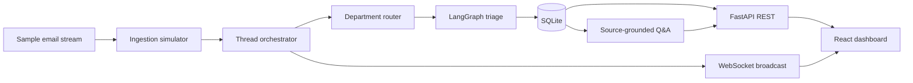

# Architecture

## Purpose

The prototype separates ingestion, triage, persistence, and presentation. The separation is useful even though the current source is a local simulator: it leaves a clear boundary for a future mailbox connector.

## Ingestion and threading

`MockStreamEmailSource` loads the sample JSON, converts timestamps, sorts messages chronologically, and emits them at a controllable playback speed. The orchestrator buffers messages by `thread_id`.

A first message is processed immediately. Follow-up messages use the configured debounce policy so a short burst of replies can be consolidated before another triage run.

The current source is local and deterministic. It does not make mailbox connections.

## Central department routing

Every thread is routed centrally when it is first processed. The router considers sender, recipients, subject, and body terms and assigns one of:

- Claims
- Motor
- Home
- Liability
- Finance

A follow-up retains the original department assignment. The handler selector only filters the dashboard view; it does not decide which messages are ingested or triaged.

## LangGraph workflow

The graph runs these stages:

1. Context merger records whether the message is a follow-up.
2. Classifier chooses Actionable, Informational, or Irrelevant and explains the decision.
3. Actionable messages go through entity and task extraction.
4. Actionable messages go through priority scoring.
5. All classifications go through consolidation so even Informational and Irrelevant threads receive a useful summary.

Structured Pydantic output constrains the model responses. Classification, extraction, and priority confidence values are retained with the triage result.

## Persistence

SQLite currently stores:

- `threads` - latest triage state and internal notes.
- `messages` - original source messages and attachments metadata.
- `audit_events` - graph stages, model, prompt version, timestamps, and decision metadata.
- `reply_drafts` - editable draft text and approval status.
- `pending_debounce` - follow-up message IDs and their scheduled processing time, allowing timers to be restored after a backend restart.

Message inserts are idempotent by `message_id`. Action IDs are assigned when state is persisted. Legacy action lists are normalised when read.

## Presentation layer

The React dashboard hydrates from REST and receives subsequent state changes over WebSockets. It provides workload, Informational, and Irrelevant views. Thread detail includes operational controls rather than only a read-only summary.

## Production boundary

A production version would replace the simulator with a mailbox adapter and add a durable queue, worker pool, identity integration, retry handling, and persistent debounce jobs. Those pieces are intentionally outside this prototype.

On shutdown, the FastAPI lifespan awaits the ingestion task, cancels scheduled debounce handles, and flushes any buffered thread batches before the process exits. Pending debounce records remain available for restart recovery if a batch cannot be completed.
